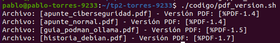
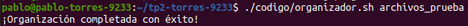
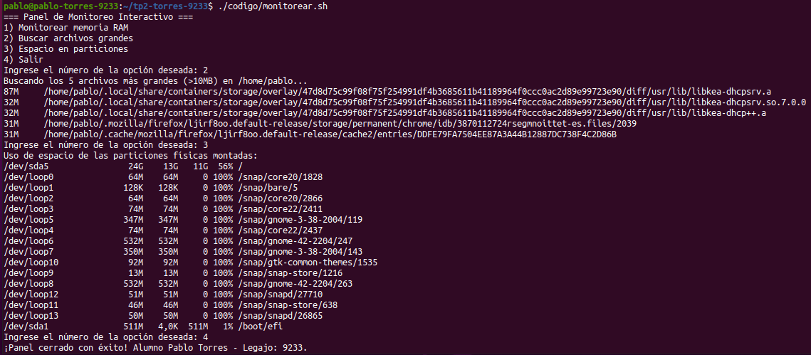
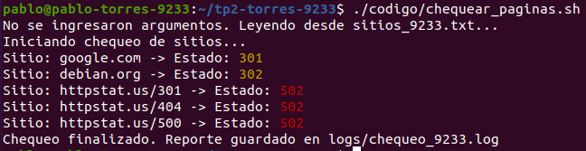
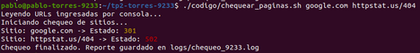
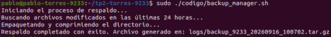

# Trabajo Práctico 2 - Automatización y Scripting

**Alumno:** Pablo Torres
**Legajo:** 9233

## Capturas de Ejecución

### 1. Script: Versión de Archivos (`pdf_version.sh`)

### 2. Script: Organizador (`organizador.sh`)

### 3. Menú Interactivo (`monitorear.sh`)

### 4. Chequeo de Páginas (`chequear_paginas.sh`)
*Ejecución leyendo desde archivo predeterminado:*

*Ejecución ingresando URLs por parámetros de consola:*

### 5. Respaldador Seguro (`backup_manager.sh`)

